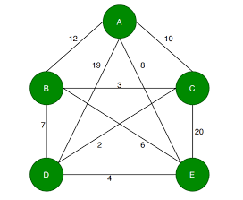

Assessment Goals

1. Combine branch and bound approaches in solving salesman problem
2.Differentiate ways that are used in dynamic programming.

 

Q1. Sam delivers items in the city among different clients located in different locations. Those locations are identified by letters and distances from one location to another in kilometers is given by a nonnegative number on path segment as shown in the graph that follows:
travelling salesman graph_assignment.png

You are approached to write a program that will find the shortest that Sam will travel to deliver items. It should be clear that Sam can only visit every location once except the starting location (he should return to the starting location after delivery). In writing the program, you are required to use memoization.

Tasks to be done:
1. Write the program and test it (ensure correctness even when the graph is changed)
2. Determine the running time of the algorithm.

 

Q2. Computing factorial of a number is very important but the computational power hugely increase with minute increase in the number. Two students were arguing, one said "the best way to implement it is memoization", the other one said "the best way to implement it is bottom up upload". Once the best algorithm is agreed, it will be upload to the calculate they are working on.

Tasks to be done:

1. Implement factorial computation using memoization. Test the program on n such that 4<= n < 1,000,00 

2. Implement factorial computation using tabulation technique (bottom up).  Test the program on n such that 4 <= n < 1,000,000

3. Identify the algorithm that works the best as the number gets big.

Solutions Document: https://docs.google.com/document/d/1AGAPAUQOw_FthcYaJifVOSm0wBFU0CFvhKv_2wmg7Do/edit 